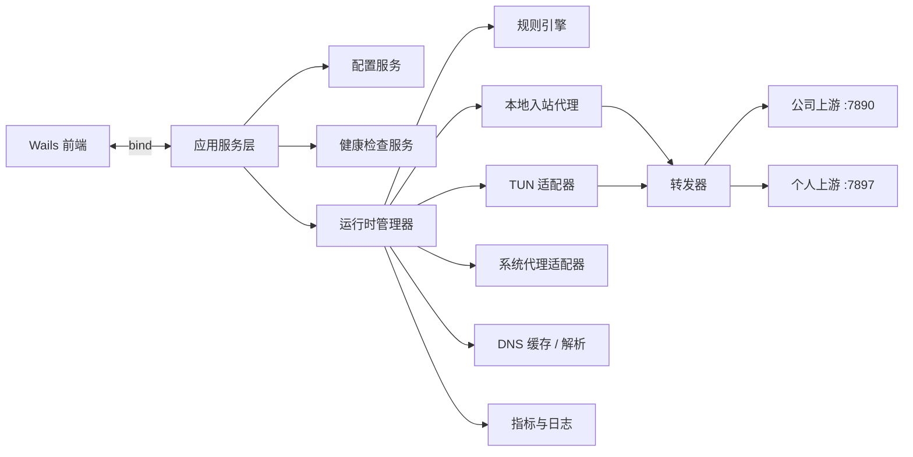
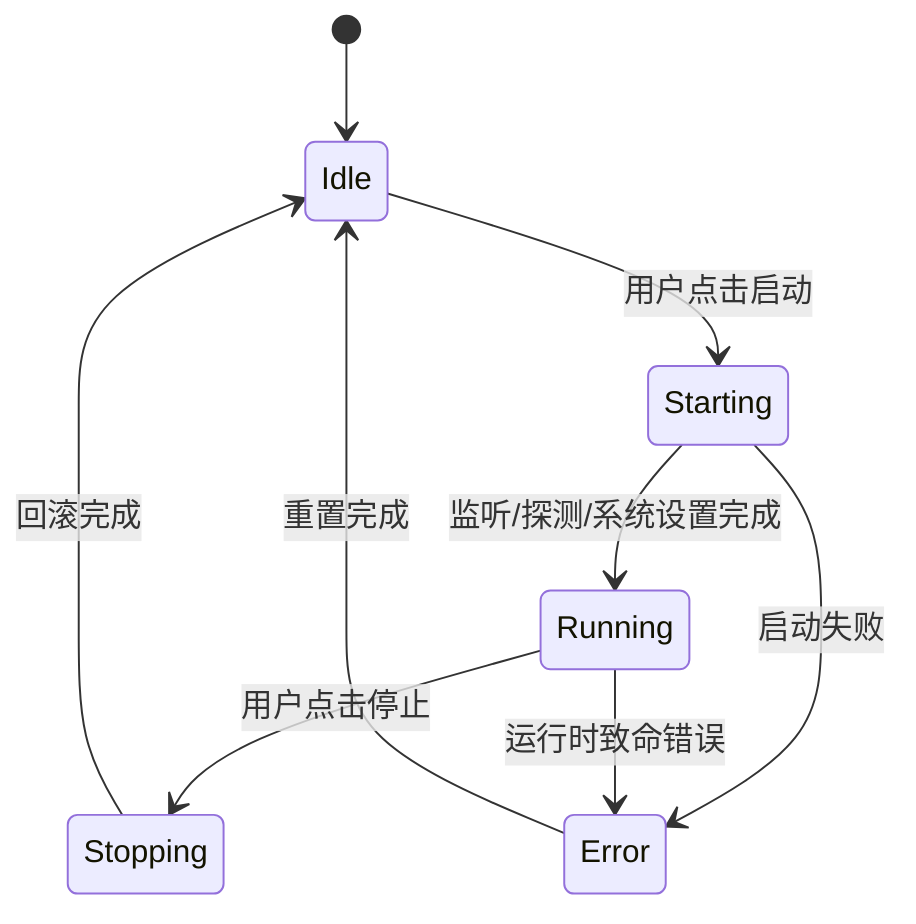

# ProxySeparator 后端详细技术文档

> 基于 `PR.md` v1.2 拆解，聚焦后端架构、运行时模型、系统集成、构建发布与 Windows / macOS 兼容性设计。

## 1. 文档目标

本文档定义 ProxySeparator MVP 后端的实现基线：

- 以后端纯 Go 实现为核心
- 通过 Wails Bind 暴露给前端稳定接口
- 支持两种运行模式
  - 系统代理模式
  - TUN 模式
- 兼容以下平台
  - Windows 10/11 x64
  - macOS 12+ Intel
  - macOS 12+ Apple Silicon
- 保证可维护、可测试、可回滚、可观测

## 2. 范围说明

### 2.1 本期范围

- 本地配置持久化
- 上游代理探测与健康检查
- 规则解析与路由决策
- 本地入站代理服务
- 公司代理 / 个人代理双上游转发
- 系统代理开启与恢复
- TUN 模式抽象与平台适配层
- 运行状态、日志、流量统计接口
- 托盘、启动、停止、异常回滚生命周期

### 2.2 MVP 暂不包含

- 云端配置同步
- IT 规则远程下发
- 多配置档案切换
- 按进程分流
- 自动更新服务完整实现
- Windows ARM / Linux 支持

## 3. 后端目标

### 3.1 功能目标

用户输入三类信息：

- 公司代理端口
- 个人代理端口
- 公司规则

后端根据规则决定流量出口：

- 命中公司规则 -> 转发到公司上游，默认 `127.0.0.1:7890`
- 其他流量 -> 转发到个人上游，默认 `127.0.0.1:7897`

### 3.2 非功能目标

- 正常模式下启动时间目标小于 `0.5s`
- 空闲内存目标 `20MB - 40MB`
- 单实例运行
- 核心分流不依赖外部在线服务
- 启停必须可恢复系统状态，避免残留代理设置

## 4. 总体架构



后端建议拆成五层：

1. 应用层：生命周期、对前端接口、托盘协调
2. 领域层：配置、规则、路由结果
3. 运行时层：监听、转发、流量统计、模式切换
4. 平台层：Windows / macOS 系统集成
5. 可观测层：日志、指标、错误事件

## 5. 推荐目录结构

```text
.
├── cmd/proxyseparator/
│   └── main.go
├── internal/app/
│   ├── app.go
│   ├── lifecycle.go
│   └── bindings.go
├── internal/config/
│   ├── model.go
│   ├── store.go
│   └── migrate.go
├── internal/rules/
│   ├── parser.go
│   ├── matcher.go
│   ├── trie.go
│   └── cidr.go
├── internal/runtime/
│   ├── manager.go
│   ├── mode_system.go
│   ├── mode_tun.go
│   ├── forwarder.go
│   ├── upstream.go
│   └── stats.go
├── internal/proxy/
│   ├── http.go
│   ├── socks5.go
│   ├── udp.go
│   └── sniff.go
├── internal/dns/
│   ├── resolver.go
│   ├── cache.go
│   └── local_server.go
├── internal/platform/
│   ├── common/
│   ├── darwin/
│   └── windows/
├── internal/logging/
│   ├── logger.go
│   └── ringbuffer.go
└── build/
    ├── windows/
    └── darwin/
```

## 6. 运行时模型

### 6.1 两种运行模式

#### 系统代理模式

这是 MVP 默认模式，也是第一阶段主推实现。

- 后端启动本地入站监听
  - HTTP 代理监听，例如 `127.0.0.1:17900`
  - SOCKS5 代理监听，例如 `127.0.0.1:17901`
- 再把操作系统系统代理切到本地监听地址
- 走系统代理的应用会统一进入 ProxySeparator
- 后端根据域名 / IP 规则决定公司出口还是个人出口

优点：

- 实现复杂度最低
- Windows 和 macOS 都相对稳定
- 不依赖底层抓包和复杂虚拟网卡逻辑

限制：

- 某些应用不会遵循系统代理
- UDP、游戏、部分 CLI / Electron 应用覆盖有限

#### TUN 模式

这是高级功能，默认关闭。

- 后端创建虚拟网卡
- 从网络层接管 TCP / UDP 流量
- 结合 DNS 缓存和规则引擎恢复域名语义
- 按规则转发到公司或个人上游

优点：

- 对 Docker、游戏、命令行工具、部分不读系统代理的桌面应用覆盖更好
- 更接近“全局分流”

风险：

- 平台差异大
- 对权限、回滚、DNS 一致性要求更高
- 首版调试成本明显高于系统代理模式

### 6.2 运行时状态机



要求：

- 运行时只能有一个活动实例
- 状态切换由单一 Runtime Manager 串行控制
- 任意失败路径都必须进入可恢复状态

## 7. 配置设计

### 7.1 配置文件位置

使用 `os.UserConfigDir()` 作为根目录：

- Windows：
  - `%AppData%/ProxySeparator/config.json`
- macOS：
  - `~/Library/Application Support/ProxySeparator/config.json`

推荐同时维护：

- `logs/runtime.log`
- `cache/dns.json`
- `cache/geoip.mmdb`

### 7.2 配置结构

```json
{
  "version": 1,
  "companyUpstream": {
    "host": "127.0.0.1",
    "port": 7890,
    "protocol": "auto"
  },
  "personalUpstream": {
    "host": "127.0.0.1",
    "port": 7897,
    "protocol": "auto"
  },
  "rules": [
    ".company.com",
    ".internal",
    "xxx.com.cn",
    "10.0.0.0/8",
    "172.16.0.0/12",
    "192.168.0.0/16"
  ],
  "advanced": {
    "mode": "system",
    "tunEnabled": false,
    "udpForwarding": false,
    "bypassChinaIP": false,
    "autoStart": false,
    "startMinimized": false
  },
  "ui": {
    "language": "zh-CN",
    "theme": "system"
  }
}
```

### 7.3 配置迁移策略

- 顶层必须保留 `version`
- 加载时执行版本判断
- 若发现旧结构则做内存迁移
- 成功后写回标准化配置
- 迁移逻辑必须幂等

## 8. 规则引擎设计

### 8.1 输入格式支持

规则编辑器按行输入，后端解析成标准化规则：

- `.company.com` -> `DOMAIN_SUFFIX`
- `.internal` -> `DOMAIN_SUFFIX`
- `xxx.com.cn` -> `DOMAIN_EXACT`
- `corp` -> `DOMAIN_KEYWORD`
- `10.0.0.0/8` -> `IP_CIDR`
- `172.16.0.0/12` -> `IP_CIDR`

预留兼容格式：

- `DOMAIN-SUFFIX,company.com`
- `DOMAIN-KEYWORD,corp`
- `IP-CIDR,10.0.0.0/8`

### 8.2 标准化规则

- 去掉首尾空白
- 忽略空行
- 忽略 `#` 开头注释
- 域名统一转小写
- 去掉 FQDN 末尾点号
- CIDR 用 `net/netip` 校验

### 8.3 数据结构建议

不同规则类型使用不同结构：

- 完整域名：
  - `map[string]struct{}`
- 域名后缀：
  - 反向标签 Trie
  - `api.internal.company.com` 拆成 `com -> company -> internal -> api`
- 关键词：
  - MVP 先用切片遍历
  - 规则规模增大后再升级 Aho-Corasick
- IP 段：
  - `[]netip.Prefix`
  - 标准化后排序，减少匹配成本

### 8.4 匹配优先级

建议按以下顺序决策：

1. 本地回环、本地网段 -> 不进入代理
2. 显式公司 IP 段规则 -> 公司上游
3. 完整域名规则 -> 公司上游
4. 域名后缀规则 -> 公司上游
5. 域名关键词规则 -> 公司上游
6. 若开启大陆 IP 绕过，则进入大陆流量分支
7. 其余全部 -> 个人上游

说明：

- 如果 MVP 阶段尚未实现真正直连，则“绕过大陆 IP”只能作为分类能力暴露给前端，不能默默改成直连
- 这部分必须在 UI 和后端行为中保持一致，避免开关语义失真

### 8.5 规则测试接口

前端的“规则测试器”依赖快速同步接口：

- 输入：域名或 IP
- 输出：
  - 命中的出口
  - 命中的规则
  - 规则类型
  - 标准化后的目标

返回示例：

```json
{
  "input": "git.company.com",
  "normalized": "git.company.com",
  "target": "company",
  "ruleType": "DOMAIN_SUFFIX",
  "matchedRule": ".company.com"
}
```

## 9. 入站代理与转发设计

### 9.1 本地监听端口

建议内部使用固定本地端口：

- HTTP 代理：`127.0.0.1:17900`
- SOCKS5 代理：`127.0.0.1:17901`
- TUN DNS：`127.0.0.1:18553`

这些端口对普通用户不暴露配置入口，但保留内部可扩展能力。

### 9.2 HTTP 代理能力

需要支持：

- 普通 HTTP 请求转发
- HTTPS `CONNECT` 隧道

路由决策可使用以下信息：

- 请求 Host
- `CONNECT` 目标域名
- 必要时的解析后 IP

### 9.3 SOCKS5 能力

需要支持：

- 域名目标
- IPv4 目标
- IPv6 目标
- TCP CONNECT
- 当 `udpForwarding=true` 时再考虑 UDP ASSOCIATE

SOCKS5 很重要，因为大量开发者工具和桌面客户端更倾向直接走 SOCKS。

### 9.4 统一转发器

在路由决策完成后，转发器对协议应尽量无感：

1. 选择公司或个人上游
2. 若上游协议为 `auto`，先做探测
3. 建立到上游的连接
4. 双向复制数据流
5. 更新统计指标
6. 写入结构化日志

#### 上游协议探测

对每个上游端口建议按顺序探测：

- TCP 连接是否可达
- SOCKS5 握手是否成功
- 若失败，再尝试 HTTP CONNECT 探测
- 探测结果缓存，状态变化时刷新

### 9.5 UDP 处理策略

UDP 只在以下场景打开：

- TUN 模式启用
- 或者完整实现了 SOCKS5 UDP ASSOCIATE 转发链路

若 UDP 不可用：

- 前端必须清晰提示限制
- 后端日志必须输出明确错误，而不是静默失败

## 10. DNS 策略

DNS 决定了规则分流能否稳定命中。

### 10.1 系统代理模式下

- 优先使用请求自带域名做匹配
- 维护一个 `domain -> ip` 的缓存，用于后续 IP 请求关联
- MVP 不建议强行接管系统 DNS

### 10.2 TUN 模式下

- 启动本地 DNS 服务
- 把 TUN 内流量的 DNS 指向本地 DNS
- 对 `domain -> ip` 建立 TTL 缓存
- IP 流量进入时利用缓存反查原始域名归属

### 10.3 防泄漏要求

必须避免这些故障：

- 系统代理已开启，但本地监听未成功
- TUN 已创建，但 DNS 服务未绑定
- 停止后仍残留域名缓存或系统代理设置
- 本地 DNS 默默回退到不可用上游

出现关键不一致时，应立即回滚到 `Idle`。

## 11. 上游健康检查

健康检查执行时机：

- 启动前
- 运行中每 `5s`
- 用户手动点击重检
- 一段时间内失败率异常升高时

每个上游需要输出：

- `reachable`
- `protocol`
  - `http`
  - `socks5`
  - `unknown`
- `lastSuccessAt`
- `rttMs`
- `consecutiveFailures`

推荐探测顺序：

1. TCP 直连
2. 协议握手
3. 如为 HTTP 代理则做轻量 CONNECT 探测

## 12. 操作系统集成层

### 12.1 Windows 设计

职责：

- 设置 / 清除 WinINet 系统代理
- 配置开机自启注册表项
- 集成 Wintun
- 协调系统托盘行为

实现建议：

- 系统代理：
  - 使用 `golang.org/x/sys/windows/registry`
  - 更新 Internet Settings 相关键值
  - 写完后通知系统刷新代理设置
- 开机自启：
  - `HKCU\\Software\\Microsoft\\Windows\\CurrentVersion\\Run`
- TUN：
  - 随包携带匹配架构的 `wintun.dll`
  - 首次开启前先检查驱动可用性

### 12.2 macOS 设计

职责：

- 用 `networksetup` 设置 / 清除系统代理
- 安装 / 移除 LaunchAgent
- 管理 utun 路径的 TUN 逻辑
- 协调菜单栏图标行为

实现建议：

- 系统代理：
  - 调用 `networksetup -setwebproxy`
  - 调用 `networksetup -setsecurewebproxy`
  - 必要时配置 `-setsocksfirewallproxy`
- 开机自启：
  - `~/Library/LaunchAgents/com.proxyseparator.app.plist`
- TUN：
  - 走兼容 utun 的实现路径
  - 尽早验证权限与网卡创建能力

### 12.3 回滚要求

不管是用户主动停止还是启动失败，都必须尽力完成：

- 清除由本应用接管的系统代理
- 停止本地监听
- 若已创建 TUN，则销毁 TUN
- 清理 DNS / 运行时缓存
- 状态改回 `Idle`

回滚过程必须逐步记录日志，便于诊断。

## 13. Wails Bind 接口设计

前端应依赖稳定接口，不自行猜测运行状态。建议接口如下：

```go
type BackendAPI interface {
    LoadConfig() (Config, error)
    SaveConfig(Config) error
    Start() (RuntimeStatus, error)
    Stop() error
    Restart() (RuntimeStatus, error)
    GetRuntimeStatus() (RuntimeStatus, error)
    GetHealthStatus() (HealthStatus, error)
    GetTrafficStats() (TrafficStats, error)
    TestRoute(input string) (RouteTestResult, error)
    ValidateRules(lines []string) (RuleValidationResult, error)
    ListLogs(limit int) ([]LogEntry, error)
    SetLanguage(lang string) error
}
```

同时建议推送事件，减少前端轮询：

- `runtime:status`
- `runtime:health`
- `runtime:traffic`
- `runtime:error`
- `runtime:log`

## 14. 并发与资源管理

并发原则：

- 模式切换由 Runtime Manager 单点加锁控制
- 每个连接使用独立 goroutine 对进行双向拷贝
- 指标计数使用原子变量
- 缓存使用带锁 map 或分片 map
- 所有后台循环都必须跟随 `context.Context`

关键要求：

- 启动阶段创建的 goroutine，在停止后必须全部退出
- 这部分要通过集成测试和泄漏检查验证

## 15. 日志与指标

### 15.1 日志

建议使用结构化日志，等级包含：

- `DEBUG`
- `INFO`
- `WARN`
- `ERROR`

建议字段：

- `timestamp`
- `module`
- `connectionId`
- `mode`
- `destination`
- `selectedUpstream`
- `matchedRule`
- `error`

实现建议：

- 保留内存 Ring Buffer，便于前端查看最近日志
- Debug 模式下同时落盘

### 15.2 指标

后端需要维护原始指标，前端只消费汇总：

- 当前模式
- 公司上游是否存活
- 个人上游是否存活
- 总连接数
- 活跃连接数
- 收发字节
- 公司流量速率
- 个人流量速率
- DNS 缓存命中率
- 启动耗时

## 16. 安全与稳定性要求

- 所有本地监听默认只绑定回环地址
- 默认不向局域网暴露无鉴权代理
- 不上传规则、日志、流量元数据
- 日志中按需脱敏
- 应用系统代理前必须先完成输入校验
- 只有在运行时进入稳定状态后，才真正写入系统代理设置

## 17. 平台兼容性设计

### 17.1 支持矩阵

| 平台 | CPU | MVP 支持 | 说明 |
| --- | --- | --- | --- |
| Windows 10/11 | x64 | 是 | Windows 主目标平台 |
| macOS 12+ | Intel (`amd64`) | 是 | 需要验证 `networksetup`、托盘、打包 |
| macOS 12+ | Apple Silicon (`arm64`) | 是 | 需要提供原生构建或 Universal 包 |

### 17.2 打包策略

#### Windows

- 产物：
  - `ProxySeparator.exe`
- 架构：
  - `windows/amd64`
- 说明：
  - Windows Intel 与 AMD 台式机 CPU 都归到 `amd64`
  - 需要同时打包匹配版本 `wintun.dll`

#### macOS

- 产物：
  - `.app` + `.dmg`
- 架构：
  - `darwin/amd64`
  - `darwin/arm64`
- 分发策略：
  - 优先方案：双架构构建后合并成 Universal App
  - 备选方案：分别提供 Intel 与 Apple Silicon 两个安装包

### 17.3 兼容性约束

- 不要写死架构相关二进制路径
- 用 `runtime.GOARCH` 做运行时判断
- 尽量避免依赖外部 helper 二进制
- 配置路径、托盘资源、启动项写法应与 CPU 架构无关
- Intel Mac 与 Apple Silicon 必须至少各验证一次真机或 CI

## 18. 构建与发布设计

### 18.1 本地构建目标

- 开发模式：
  - 使用 Wails dev
- 发布模式：
  - 构建前端资源
  - 编译 Go 后端
  - 打包系统原生产物

### 18.2 建议 CI 矩阵

| Job | OS | Arch | 目的 |
| --- | --- | --- | --- |
| `windows-release` | Windows | amd64 | 构建 `.exe` 并跑集成测试 |
| `macos-intel-release` | macOS | amd64 | 构建 Intel 版 `.app` |
| `macos-apple-release` | macOS | arm64 | 构建 Apple Silicon 版 `.app` |

如果要求 Universal 包，则在两个 macOS Job 之后增加合包 / 签名 / 公证步骤。

## 19. 测试计划

### 19.1 单元测试

- 规则解析标准化
- 精确域名 / 后缀 / 关键词 / CIDR 匹配
- 配置迁移
- 上游协议探测
- 状态机切换
- 指标计数与速率计算

### 19.2 集成测试

- 系统代理模式启动与回滚
- 混合规则命中决策
- HTTP CONNECT 分流到公司 / 个人上游
- SOCKS5 分流到公司 / 个人上游
- 单上游或双上游异常时的启动失败路径
- 配置保存与重启恢复

### 19.3 跨平台人工验证

最小人工验证矩阵：

- Windows 10/11 x64
- macOS 12 或 13 Intel
- macOS 14+ Apple Silicon

验证项：

- 首次启动
- 自动探测上游
- 启动 / 停止隔离
- 崩溃后重启
- 托盘 / 菜单栏行为
- 休眠唤醒
- 开机自启
- TUN 权限与失败提示

## 20. 实施优先级

### 第一阶段

- 配置服务
- 规则引擎
- 本地 HTTP / SOCKS5 入站
- 上游健康检查
- Wails Bind 接口
- 系统代理模式

### 第二阶段

- 实时流量统计
- 日志查看能力
- 规则测试器
- 托盘集成

### 第三阶段

- TUN 模式
- UDP 转发
- GeoIP 集成
- macOS Universal 包

## 21. 结论

- 首发版本应以系统代理模式为主线，保证稳定交付
- TUN 模式必须保持显式开关，完成平台验证后再主推
- macOS 需要同时覆盖 Intel 与 Apple Silicon，可以通过 Universal 包或双构建方案实现
- Windows 目标统一为 `amd64`，已覆盖主流 Intel / AMD 机器
- 后端必须对系统状态变更负责，并保证异常时能够清理干净
