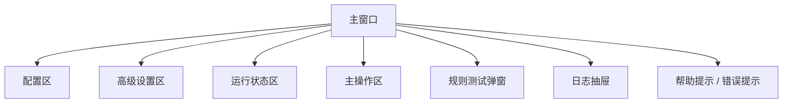

# ProxySeparator 前端设计文档

> 基于 `PR.md` v1.2 拆解，定义桌面端前端的信息架构、视觉体系、交互模型，以及 Windows / macOS 的跨平台设计约束。

## 1. 设计目标

前端只有一个核心目标：让用户在不理解代理底层原理的前提下，用三分钟完成配置并可信地启动分流。

整体体验应当具备以下特征：

- 简洁
- 可解释
- 可信
- 足够原生
- 在持续状态更新时依然流畅

## 2. 产品设计原则

### 2.1 单窗口优先

MVP 不做复杂多页面导航，主交互集中在一个主窗口内完成。

主窗口必须覆盖：

- 配置输入
- 运行状态
- 高级开关
- 简易诊断
- 启动 / 停止主操作

### 2.2 尽量说人话

UI 不应该把后端术语直接扔给用户，应尽量转成用户可理解表达。

示例：

- `公司代理端口`，而不是 `上游 A`
- `个人 VPN 端口`，而不是 `上游 B`
- `公司规则`，而不是 `路由策略表达式`

### 2.3 默认安全

- 默认模式是系统代理模式
- TUN 模式放在高级设置中
- 风险功能需要明确提示
- 所有输入都在真正改系统设置前校验完成

### 2.4 状态必须可见

用户必须能一眼看到：

- 公司代理是否存活
- 个人代理是否存活
- 当前运行模式是什么
- 流量是否真的在分流
- 失败具体失败在什么地方

## 3. 范围说明

### 3.1 本期范围

- 主窗口布局
- 规则测试弹窗
- 日志抽屉 / 诊断面板
- 托盘 / 菜单栏入口
- 首次启动默认体验
- 中英文文案结构

### 3.2 MVP 暂不包含

- 主题市场
- 多窗口流程
- 按进程统计页
- 历史趋势分析页面

## 4. 信息架构

当前产品适合“单主界面 + 浮层”的结构。



## 5. 主窗口布局设计

### 5.1 默认窗口尺寸

推荐初始尺寸：

- 宽度：`980`
- 高度：`720`

最小尺寸：

- 宽度：`860`
- 高度：`620`

窄屏堆叠阈值：

- 小于 `900px` 时，右侧运行信息区域自动下移堆叠

### 5.2 布局结构

```text
┌──────────────────────────────────────────────────────────────┐
│ 标题栏 / 头部                                                │
│ App 名称 | 当前模式 | 公司代理状态 | 个人代理状态            │
├───────────────────────────────┬──────────────────────────────┤
│ 左侧：核心配置区              │ 右侧：运行状态 / 诊断区      │
│ - 公司端口                    │ - 公司流量卡片               │
│ - 个人端口                    │ - 个人流量卡片               │
│ - 公司规则编辑器              │ - 当前模式卡片               │
│ - 辅助说明                    │ - 最近日志 / 快捷操作        │
├───────────────────────────────┴──────────────────────────────┤
│ 高级设置区                                                     │
├──────────────────────────────────────────────────────────────┤
│ 底部主操作栏：启动 / 停止 / 测试 / 保存                      │
└──────────────────────────────────────────────────────────────┘
```

### 5.3 视觉优先级

从高到低建议如下：

1. 当前运行健康状态
2. 必填配置项
3. 启动 / 停止主按钮
4. 高级设置
5. 调试与诊断信息

## 6. 核心区域设计

### 6.1 头部区域

作用：

- 标识应用身份
- 显示当前运行模式
- 显示两个上游代理健康状态

内容建议：

- 标题：`ProxySeparator`
- 副标题：`公司流量走公司代理，其余走个人代理`
- 模式 Badge：
  - `系统代理模式`
  - `TUN 模式`
- 健康状态 Badge：
  - `公司代理 7890`
  - `个人代理 7897`
- 快捷按钮：
  - `路由测试`

设计要求：

- 健康状态实时更新
- 不能只靠颜色区分状态，必须同时配合图标与文字

### 6.2 核心配置区

字段包括：

1. 公司代理端口
2. 个人 VPN 端口
3. 公司规则编辑框

每个字段都应包含：

- 标签
- 简短说明
- 校验状态
- 必要时的自动探测按钮

#### 公司代理端口输入框

行为要求：

- 默认值 `7890`
- 只允许 `1-65535`
- 探测完成后显示协议类型：
  - `HTTP`
  - `SOCKS5`
  - `未识别`

#### 个人 VPN 端口输入框

行为要求：

- 默认值 `7897`
- 与公司代理端口一致的校验和协议显示逻辑

#### 公司规则编辑器

能力要求：

- 支持多行粘贴
- 保留原始顺序
- 展示规则解析摘要
- 在编辑器内或下方显示无效行

摘要示例：

- `共 12 条规则`
- `域名后缀 6`
- `完整域名 2`
- `关键词 1`
- `CIDR 3`

辅助操作：

- `粘贴示例`
- `清空`
- `校验规则`

### 6.3 高级设置区

高级设置默认折叠，但要让用户能明显看到入口。

开关项：

- `启用 TUN 模式`
- `启用 UDP 转发`
- `绕过大陆 IP`
- `开机自启`

每个开关都要有说明文案。

示例：

- `启用 TUN 模式`
  - `适用于不走系统代理的应用，例如游戏、Docker、部分 Electron 应用`

依赖约束：

- `UDP 转发` 依赖 TUN 或完整后端能力
- 若当前组合不支持，必须显示内联提示，不能让用户在失败后才知道

### 6.4 运行状态区

右侧区域主要承担实时反馈职责。

建议卡片：

- `公司流量`
- `个人流量`
- `当前模式`
- `运行时长`

可选辅助信息：

- `活动连接数`
- `最近命中的规则`
- `最近一次错误`

设计要求：

- 公司流量与个人流量使用两套清晰区分但同等强调的色彩
- 不要只用红绿二元颜色表达全部状态

### 6.5 诊断区

目标是让用户不打开终端也能初步自查。

内容建议：

- 最近 `10-20` 条日志
- 启动失败时的错误横幅
- 快捷动作：
  - `复制日志`
  - `重新检测端口`
  - `打开路由测试`

交互建议：

- 默认紧凑显示
- 支持展开查看完整日志抽屉

### 6.6 底部主操作栏

主按钮状态：

- 空闲时：`启动隔离`
- 运行时：`停止隔离`

次级操作：

- `保存配置`
- `路由测试`
- `查看日志`

规则：

- 主按钮必须始终可见
- 启动 / 停止过程中进入阻塞加载态
- 若存在未保存修改，显示轻量脏状态提示

## 7. 规则测试器弹窗

### 7.1 目标

用户输入域名或 IP，立即看到会走公司还是个人出口，以及命中了哪条规则。

### 7.2 弹窗内容

- 输入框
- 结果卡片
- 命中规则区域
- 操作按钮

结果状态：

- `走公司代理`
- `走个人代理`
- `无效输入`
- `未命中规则，走默认策略`

### 7.3 交互要求

- 回车可直接触发测试
- 命中结果尽量在 `200ms` 内返回
- 保留最近 `5` 次测试输入，供当前会话回看

## 8. 托盘与菜单栏设计

### 8.1 macOS 菜单栏

菜单项：

- `启动隔离` / `停止隔离`
- `打开主窗口`
- `路由测试`
- `退出`

macOS 侧要求：

- 使用 Template Icon，以适配浅色 / 深色菜单栏
- 文案保持简洁，避免过长菜单项

### 8.2 Windows 系统托盘

菜单项：

- `启动隔离` / `停止隔离`
- `打开设置`
- `路由测试`
- `退出`

Windows 侧要求：

- 提供多尺寸 `.ico`
- Tooltip 控制在较短长度，例如 `ProxySeparator - 运行中`

## 9. 状态管理设计

前端必须把“配置状态”和“运行时状态”分开管理。

### 9.1 建议状态分层

#### 配置状态

- 公司 host / port
- 个人 host / port
- 原始规则文本
- 高级开关
- dirty 标记

#### 运行时状态

- `idle | starting | running | stopping | error`
- 当前模式
- 健康状态
- 流量统计
- 最近错误
- 运行时长

#### UI 状态

- 高级设置是否展开
- 日志抽屉是否打开
- 规则测试弹窗是否打开
- 当前语言
- toast 队列

### 9.2 建议 Store 结构

```ts
type AppStore = {
  config: ConfigFormState;
  runtime: RuntimeState;
  ui: UIState;
  actions: {
    loadConfig: () => Promise<void>;
    saveConfig: () => Promise<void>;
    startRuntime: () => Promise<void>;
    stopRuntime: () => Promise<void>;
    testRoute: (input: string) => Promise<RouteTestResult>;
    refreshHealth: () => Promise<void>;
  };
};
```

建议：

- 纯展示组件继续用 React 本地状态
- 跨区域共享的运行时与配置状态统一放进 Store 或 Context
- 运行状态尽量走事件驱动，不做高频盲轮询

## 10. 关键交互流程

### 10.1 首次启动流程

1. 读取本地配置
2. 如无配置则填入默认值
3. 自动探测 `7890` 与 `7897`
4. 显示两个上游的存活状态
5. 只有当必要输入非法时才禁用主按钮

### 10.2 启动流程

1. 用户点击 `启动隔离`
2. 前端先做输入校验
3. 把配置提交给后端
4. 显示步骤型进度：
   - `正在保存配置`
   - `正在检测上游代理`
   - `正在启动本地代理`
   - `正在应用系统设置`
5. 成功后：
   - 主按钮切到 `停止隔离`
   - 显示成功提示
   - 开始订阅实时流量与状态

### 10.3 停止流程

1. 用户点击 `停止隔离`
2. 进入阻塞加载态
3. 等待后端清理系统状态
4. 恢复为 `idle`
5. 显示 `系统代理已恢复` 或同类确认信息

### 10.4 错误流程

错误文案必须具体，不能只显示“启动失败”。

示例：

- `公司代理端口 7890 无法连接，请先启动公司 VPN`
- `TUN 模式初始化失败，请检查系统权限`
- `规则中有 2 行无效，请修正后再启动`

错误区应包含：

- 简短错误说明
- 建议操作
- 可展开的详细信息

### 10.5 运行中编辑策略

MVP 建议：

- 运行时锁定端口和规则编辑
- 只允许以下动作：
  - 打开规则测试器
  - 查看日志
  - 停止运行

这样可以避免首版热更新配置带来的复杂状态同步问题。

## 11. 视觉设计系统

### 11.1 整体风格

不要把它做成普通后台管理台，而要更像一个精密桌面工具：

- 中性、干净的背景
- 强但克制的状态色
- 信息密度较高但依然清晰
- 减少无意义装饰

### 11.2 色彩 Token

建议配色：

- 背景：`#F4F7F8`
- 卡片底：`#FFFFFF`
- 卡片边框：`#D7E0E4`
- 主文本：`#10212B`
- 次级文本：`#52636D`
- 公司流量强调色：`#0F7B8F`
- 个人流量强调色：`#E17A2D`
- 成功：`#1D8F5A`
- 警告：`#C58A14`
- 错误：`#C84A4A`

原则：

- 不依赖高饱和渐变维持识别度
- 公司与个人两条路径在图表和标签中必须明显不同
- 红色主要保留给错误，不要把“停止按钮”默认做成刺眼危险态

### 11.3 字体体系

推荐方案：

- 主 UI 字体：
  - 内置：`IBM Plex Sans`
  - 回退：`"SF Pro Display", "Segoe UI Variable", "PingFang SC", "Microsoft YaHei UI", sans-serif`
- 等宽字体：
  - 内置：`JetBrains Mono`

原因：

- 拉丁字符和数字可读性好
- 中文回退路径稳定
- Windows 与 macOS 渲染一致性较好

### 11.4 间距与密度

- 使用 `8px` 体系
- 卡片圆角：`16px`
- 输入框高度：`44px`
- 紧凑列表行高：`32px`
- 底部主操作栏视觉重量高于普通卡片

### 11.5 动效

动效只服务于状态理解：

- 启动 / 停止阶段淡入淡出
- 状态变更时 Badge 轻微脉冲
- 日志抽屉滑出
- 规则测试器弹窗缩放淡入

时长建议：

- 小交互：`120ms`
- 抽屉 / 弹窗：`180ms`

不要引入持续运动型装饰动画。

## 12. 组件拆分建议

```text
AppShell
├── TitleHeader
├── ConfigForm
│   ├── UpstreamPortField
│   ├── UpstreamPortField
│   ├── RulesEditor
│   └── RuleSummary
├── RuntimeSidebar
│   ├── HealthStatusRow
│   ├── TrafficCards
│   ├── ModeCard
│   └── DiagnosticsPreview
├── AdvancedPanel
│   └── ToggleSettingItem[]
├── ActionBar
├── RouteTesterModal
└── LogsDrawer
```

## 13. 前端目录建议

```text
frontend/src/
├── app/
│   ├── App.tsx
│   ├── providers.tsx
│   └── store.ts
├── components/
│   ├── shell/
│   ├── config/
│   ├── runtime/
│   ├── diagnostics/
│   └── shared/
├── features/
│   ├── route-tester/
│   ├── logs/
│   └── tray/
├── lib/
│   ├── wails.ts
│   ├── format.ts
│   └── validators.ts
├── styles/
│   ├── globals.css
│   └── tokens.css
└── types/
    └── backend.ts
```

## 14. 与后端接口的协作要求

前端不能自己猜测运行时状态，关键状态必须来自后端 Bind 或事件流。

必须获取的数据：

- 保存后的配置
- 上游健康状态
- 当前运行状态
- 实时流量统计
- 规则测试结果
- 校验错误
- 日志内容

建议：

- 优先采用事件驱动更新，而不是高频轮询

## 15. 无障碍与国际化

### 15.1 无障碍要求

- 每个输入框必须有稳定文本标签
- 状态颜色必须搭配图标和文本
- 键盘可遍历全部交互控件
- 弹窗必须有焦点锁
- 错误提示文本要具备可读性，即便在桌面壳环境中也要考虑无障碍

### 15.2 国际化要求

MVP 语言：

- 简体中文
- English

要求：

- 所有静态文案都走 i18n key
- 规则示例可以保持语言中立
- 数字、速率、时间格式遵循本地语言环境

## 16. 跨平台设计规则

### 16.1 通用规则

- UI 要在 `100% / 125% / 150% / 200%` 缩放下保持清晰
- 不要为长文本写死平台相关宽度
- 不要依赖 hover 作为唯一交互入口
- 图标必须兼容 Retina 与非 Retina 显示

### 16.2 macOS 规则

- 同一套 UI 资源同时支持 Intel 与 Apple Silicon
- 如果使用自定义标题栏，要预留足够顶部拖拽 / 安全区域
- 毛玻璃或半透明只能作为增强，不能依赖它保证可读性
- 菜单栏图标必须是模板图标
- 快捷键使用 `Cmd`

### 16.3 Windows 规则

- 重点验证 ClearType 与 `125%` 缩放
- 标题栏拖拽区和系统按钮区不能冲突
- 托盘图标至少提供 `16/20/24/32` 像素版本
- 快捷键使用 `Ctrl`

### 16.4 架构兼容性要求

从前端角度看，Intel Mac 与 Apple Silicon Mac 应共享：

- 同一套 React 代码
- 同一套 CSS Token
- 同一套图标和字体资源

不要为不同 CPU 架构写前端逻辑分支。架构差异只应该出现在打包与后端运行层。

## 17. 空状态、加载态与错误态

必须设计这些基础状态：

- 没有本地配置
- 上游未探测到
- 正在启动
- 正在停止
- 暂无日志
- 规则测试器初始空态

每种状态都应包含：

- 一句明确说明
- 必要时一个操作入口
- 不做模糊占位图表达

## 18. 验收清单

- 用户无需看外部文档即可在主窗口完成配置
- 两个上游端口都能显示实时状态
- 规则可以先校验再启动
- 规则测试器能清晰展示出口与命中规则
- 运行态和空闲态视觉上明显不同
- Windows 托盘和 macOS 菜单栏流程都可用
- Windows 与 macOS 高 DPI 下 UI 都不变形
- UI 不依赖 Intel / Apple Silicon 差异做逻辑分支

## 19. 结论

- MVP 采用“一个主窗口 + 弹窗 / 抽屉浮层”的结构最合适
- 默认以双栏桌面布局为主，小于 `900px` 时自动堆叠
- 视觉上应更像精密工具，而不是通用后台
- 运行状态与主操作优先级必须高于高级设置
- Windows 与 macOS 本质上是一套产品，只保留少量原生交互差异
