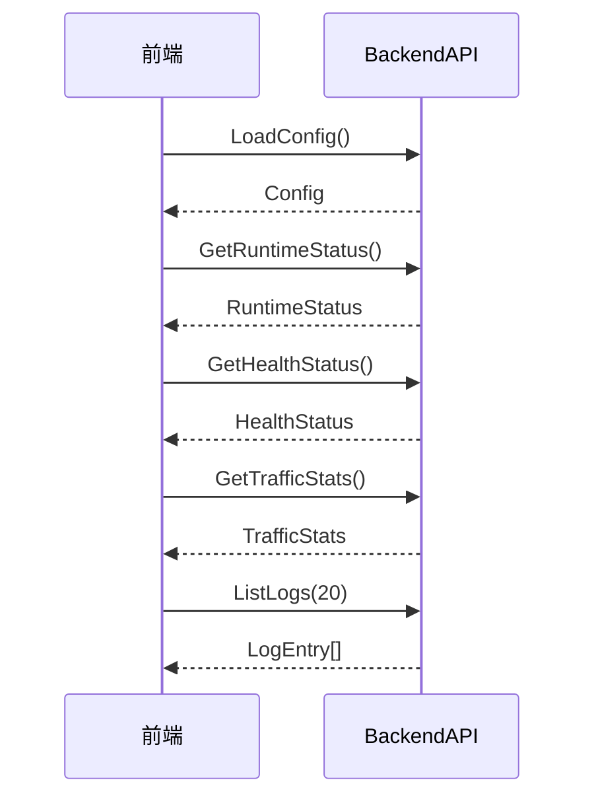
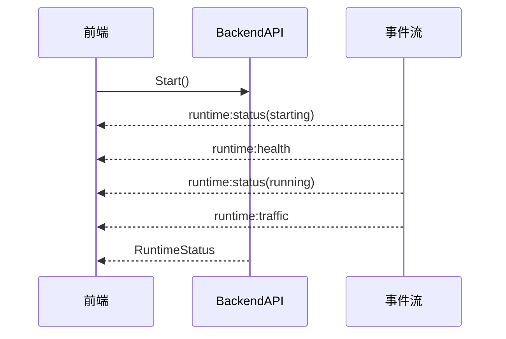
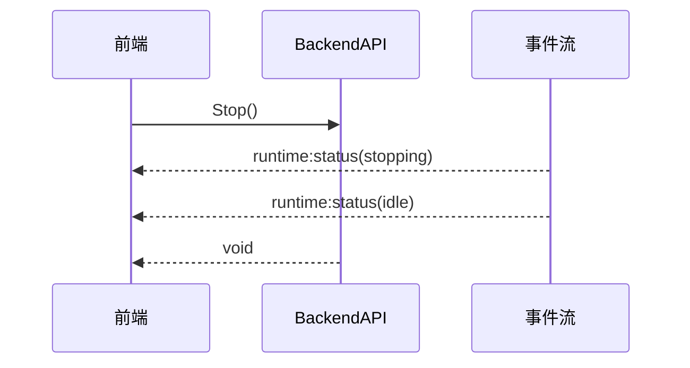
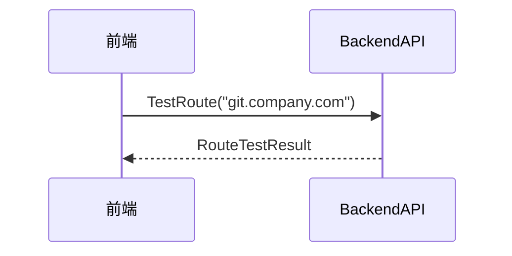
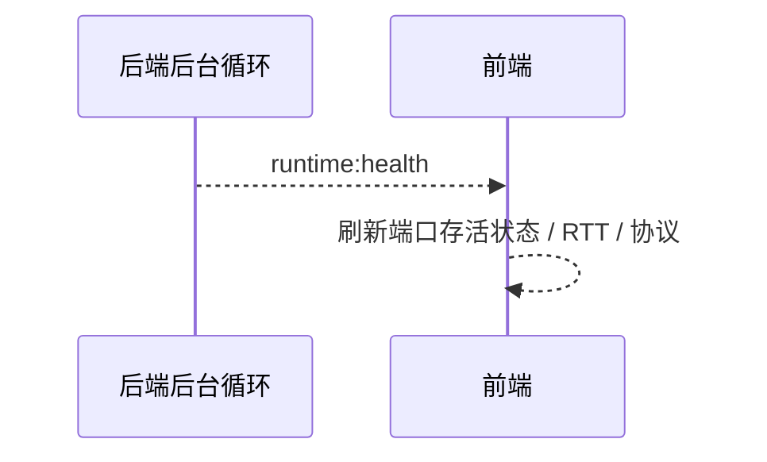

# ProxySeparator 前端接口文档

> 本文档面向前端开发，描述当前后端通过 Wails Bind 暴露的方法、事件、数据结构、错误码与关键交互时序。字段名保持英文，说明使用中文。

## 1. 对接方式

- 服务名：`BackendAPI`
- 调用形式：`window.wails.Call("BackendAPI.<Method>", ...args)`
- 事件流：
  - `runtime:status`
  - `runtime:health`
  - `runtime:traffic`
  - `runtime:error`
  - `runtime:log`

## 2. Bind 方法清单

### `LoadConfig() => Config`

- 用途：读取本地配置，首屏初始化时调用
- 调用时机：应用启动后立即调用
- 成功返回：完整 `Config`
- 典型错误：
  - `ERR_CONFIG_LOAD_FAILED`

### `SaveConfig(config: Config) => void`

- 用途：保存配置
- 调用时机：用户点击保存，或启动前显式落盘
- 典型错误：
  - `ERR_INVALID_CONFIG`
  - `ERR_RULE_VALIDATION_FAILED`
  - `ERR_CONFIG_SAVE_FAILED`

### `Start() => RuntimeStatus`

- 用途：启动隔离
- 调用时机：用户点击“启动隔离”
- 行为：
  - 校验规则
  - 检查两个上游代理
  - 启动本地 HTTP/SOCKS5 代理
  - 系统代理模式下写系统代理
  - TUN 模式下启动本地 DNS 并尝试启动平台 TUN
- 典型错误：
  - `ERR_UPSTREAM_UNAVAILABLE`
  - `ERR_PROXY_LISTEN_FAILED`
  - `ERR_SYSTEM_PROXY_FAILED`
  - `ERR_TUN_UNAVAILABLE`
  - `ERR_RUNTIME_ALREADY_RUNNING`

### `Stop() => void`

- 用途：停止隔离并恢复系统状态
- 调用时机：用户点击“停止隔离”
- 典型错误：
  - `ERR_RUNTIME_NOT_RUNNING`
  - `ERR_RUNTIME_STOP_FAILED`

### `Restart() => RuntimeStatus`

- 用途：停止后重新启动
- 调用时机：用户明确点击重启时
- 典型错误：
  - 同 `Start` / `Stop`

### `GetRuntimeStatus() => RuntimeStatus`

- 用途：主动拉取当前运行状态
- 调用时机：初始化、从后台恢复、事件流重连后兜底

### `GetHealthStatus() => HealthStatus`

- 用途：主动拉取健康状态
- 调用时机：初始化或用户手动刷新

### `GetTrafficStats() => TrafficStats`

- 用途：主动拉取流量统计
- 调用时机：初始化或事件流重连后兜底

### `TestRoute(input: string) => RouteTestResult`

- 用途：规则测试器
- 调用时机：用户输入域名 / IP 后点击测试
- 输入支持：
  - 域名
  - IPv4 / IPv6
  - 带端口地址会自动去掉端口参与匹配

### `ValidateRules(lines: string[]) => RuleValidationResult`

- 用途：规则校验
- 调用时机：保存前、启动前、规则编辑器显式点击校验

### `ListLogs(limit: number) => LogEntry[]`

- 用途：读取最近日志
- 调用时机：初始化日志面板，或用户打开日志抽屉

### `SetLanguage(lang: string) => void`

- 用途：切换 UI 语言并保存到配置
- 调用时机：用户切换语言时

## 3. 事件清单

### `runtime:status`

- 触发时机：
  - 启动进入 `starting`
  - 成功进入 `running`
  - 停止进入 `stopping`
  - 回滚后回到 `idle`
  - 运行中每秒刷新一次 `uptimeSeconds`
- payload：`RuntimeStatus`
- 前端用途：
  - 更新主按钮文案
  - 控制表单只读态
  - 更新顶部模式状态

### `runtime:health`

- 触发时机：
  - 启动前首次探测
  - 运行中每 5 秒
- payload：`HealthStatus`
- 前端用途：
  - 刷新公司 / 个人端口存活状态
  - 展示协议类型和 RTT

### `runtime:traffic`

- 触发时机：
  - 启动完成后立即推送一次
  - 运行中每 1 秒
- payload：`TrafficStats`
- 前端用途：
  - 刷新流量卡片
  - 刷新活动连接数

### `runtime:error`

- 触发时机：预留
- 当前实现：尚未单独推送结构化错误事件，错误主要通过方法调用返回
- 前端建议：先以方法错误为主，后续若该事件有 payload，再接统一错误中心

### `runtime:log`

- 触发时机：后端写日志时实时推送
- payload：`LogEntry`
- 前端用途：
  - 追加日志列表
  - 在错误级别日志出现时显示提示

## 4. TypeScript 类型映射

```ts
type Config = {
  version: number;
  companyUpstream: { host: string; port: number; protocol: string };
  personalUpstream: { host: string; port: number; protocol: string };
  rules: string[];
  advanced: {
    mode: string;
    tunEnabled: boolean;
    udpForwarding: boolean;
    bypassChinaIP: boolean;
    autoStart: boolean;
    startMinimized: boolean;
  };
  ui: { language: string; theme: string };
};

type RuntimeStatus = {
  state: "idle" | "starting" | "running" | "stopping" | "error";
  mode: "system" | "tun";
  startedAt?: string;
  uptimeSeconds: number;
  lastErrorCode?: string;
  lastErrorMessage?: string;
};

type HealthStatus = {
  checkedAt?: string;
  company: UpstreamHealth;
  personal: UpstreamHealth;
};

type UpstreamHealth = {
  reachable: boolean;
  protocol: "auto" | "http" | "socks5" | "unknown";
  rttMs: number;
  lastSuccessAt?: string;
  consecutiveFailures: number;
};

type TrafficStats = {
  mode: string;
  startedAt?: string;
  activeSessions: number;
  totalSessions: number;
  rxBytes: number;
  txBytes: number;
  companyBytes: number;
  personalBytes: number;
  rxBytesPerSecond: number;
  txBytesPerSecond: number;
  companyBytesPerSecond: number;
  personalBytesPerSecond: number;
};

type RouteTestResult = {
  input: string;
  normalized: string;
  target: "company" | "personal" | "direct";
  ruleType: string;
  matchedRule?: string;
  reason?: string;
};

type RuleValidationResult = {
  validRules: string[];
  invalidRules: Array<{ line: number; input: string; reason: string }>;
  summary: {
    total: number;
    valid: number;
    invalid: number;
    domainSuffix: number;
    domainExact: number;
    domainKeyword: number;
    cidr: number;
  };
};

type LogEntry = {
  timestamp: string;
  level: "DEBUG" | "INFO" | "WARN" | "ERROR";
  module: string;
  message: string;
  fields?: Record<string, unknown>;
};
```

## 5. 页面 / 组件映射

### 主窗口配置区

- 依赖：
  - `LoadConfig`
  - `SaveConfig`
  - `ValidateRules`

### 主按钮与运行状态区

- 依赖：
  - `Start`
  - `Stop`
  - `GetRuntimeStatus`
  - `runtime:status`

### 健康状态区

- 依赖：
  - `GetHealthStatus`
  - `runtime:health`

### 流量卡片

- 依赖：
  - `GetTrafficStats`
  - `runtime:traffic`

### 规则测试器

- 依赖：
  - `TestRoute`

### 日志面板

- 依赖：
  - `ListLogs`
  - `runtime:log`

## 6. 错误码约定

| 错误码 | 含义 | 前端建议 |
| --- | --- | --- |
| `ERR_INVALID_CONFIG` | 配置非法 | 阻止保存 / 启动，并定位表单 |
| `ERR_CONFIG_LOAD_FAILED` | 配置读取失败 | 显示初始化错误提示 |
| `ERR_CONFIG_SAVE_FAILED` | 配置写入失败 | 提示用户重试 |
| `ERR_RULE_VALIDATION_FAILED` | 规则不合法 | 展示无效规则列表 |
| `ERR_UPSTREAM_UNAVAILABLE` | 上游端口不可达 | 顶部错误横幅 + 端口字段提示 |
| `ERR_PROXY_LISTEN_FAILED` | 本地代理监听失败 | 提示端口冲突或权限问题 |
| `ERR_SYSTEM_PROXY_FAILED` | 系统代理设置失败 | 提示权限或系统环境问题 |
| `ERR_TUN_UNAVAILABLE` | TUN 启动条件不满足或平台初始化失败 | 提示检查权限、驱动依赖，必要时切回系统代理模式 |
| `ERR_RUNTIME_ALREADY_RUNNING` | 已经在运行 | 直接刷新状态即可 |
| `ERR_RUNTIME_NOT_RUNNING` | 当前未运行 | 直接刷新状态即可 |
| `ERR_PERMISSION_DENIED` | 权限不足 | 引导用户提升权限 |
| `ERR_PLATFORM_UNSUPPORTED` | 当前平台不支持 | 灰掉对应功能 |
| `ERR_INTERNAL` | 未分类内部错误 | 统一兜底提示 |

## 7. 关键交互时序

### 首次加载



### 启动隔离



### 停止隔离



### 规则测试



### 健康状态刷新



## 8. 当前实现说明

- 系统代理模式仍然是默认主路径。
- TUN 模式现在会启动本地 DNS、平台 TUN helper、并写入分流路由；成功后事件流与系统代理模式一致。
- TUN 启动仍然依赖运行权限、Windows 下的 `wintun.dll`、以及平台网络命令可用性；前端应继续把它视为“可见但可能失败”的高级能力。
